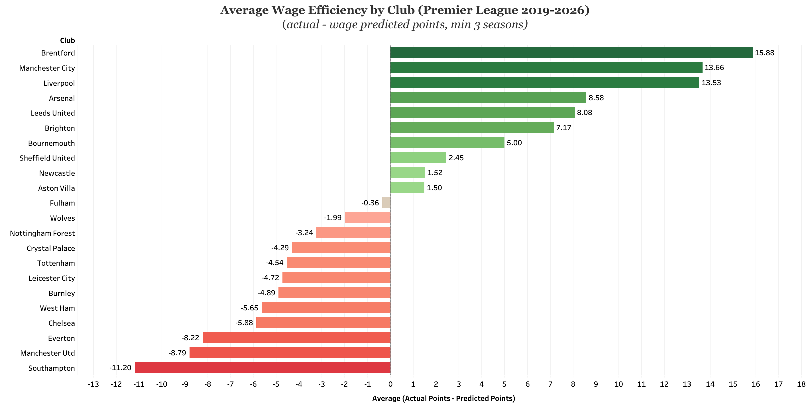

# Player-Wage Efficiency in the Premier League

**Isolating and testing the persistence of performance unexplained by player wages (2019/20–2025/26)**

Money buys success in football, but not all of it. This study measures how much of a single season's points tally is explained by player wages, isolates the performance that *isn't*, and tests whether that unexplained performance persists season to season: the difference between a durable operational edge and simple good fortune.

## Key findings

- Player wages explain **under half** (R² = 0.465) of the variation in a single season's points across 140 club-seasons. Doubling a wage bill is associated with roughly **15 extra points**.
- The unexplained performance — "wage efficiency" — **persists**. An AR(1) model on 112 consecutive-season pairs gives a persistence coefficient of **0.383** (p < 0.001, cluster-robust): around 38% of a club's over- or under-performance carries into the following season.
- The persistence coefficient is significantly above zero, so it is **not pure chance**; but well below one, so it is **not pure skill** either. A durable, non-wage component genuinely exists, but transient factors still dominate any individual season.
- Over the period, **Brentford (+15.9 points/season), Manchester City (+13.7 points/season) and Liverpool (+13.5 points/season)** were the most wage-efficient clubs; **Southampton (−11.2 points/season), Manchester United (−8.8 points/season) and Everton (−8.2 points/season)** the least.

---




## Method

Two stages:

1. **Points–wage regression.** OLS of league points on log annual player wages with season fixed effects, cluster-robust standard errors clustered by club. The residual (actual minus wage-predicted points) is the club-season's *wage efficiency*.
2. **Persistence test.** A pooled first-order autoregression of each residual on the same club's previous-season residual. Luck does not repeat; durable advantage does. The coefficient measures how much carries over: significant persistence licenses the interpretation of the residual as *wage efficiency* rather than merely noise.

Design choices are set out in full in the write-up: log transformation (diminishing returns, leverage, interpretability), season fixed effects (removing league-wide drift), and clustering rather than club fixed effects (preserving the between-club differences that are the object of study, and avoiding Nickell bias in a short panel with a lagged dependent variable).

## Data

Seven Premier League seasons, 2019/20–2025/26, 140 club-seasons. Points from **FBref**; annual player wage bills from **Capology**.

The window starts at 2019/20 because that is when Capology began applying its salary verification method: earlier wage bills are fully estimated. Capology notes that accuracy correlates with league popularity, which is part of why this study is confined to the Premier League. All figures, including verified ones, remain estimates; results should be read as indicative of a relationship rather than exact measurements of it.

## Repository contents

```
[/data]        Raw league position and wage data (FBref, Capology), one file per season
[/scripts]     R scripts: setup, join, regression, diagnostics, persistence, exports, visualisation
[/figures]     Exported charts (PNG)
[/output]      Regression summaries: CSV tables are generated by running the scripts
[write-up.pdf] Full formal write-up
```

**Running the analysis:** 
Open `WageProject.Rproj` and run the scripts in numerical order within a single R session: scripts 04–07 use model objects created by 03 and 05, so they can't be run in isolation. Requires `readxl`, `dplyr`, `sandwich`, `lmtest`, `ggplot2`, `plotly`.


## Charts

- **Points vs log wage bill** (interactive, Tableau Public) — [https://public.tableau.com/views/PremierLeagueWageEfficiency2019-2026/Dashboard1?:language=en-GB&:sid=&:redirect=auth&:display_count=n&:origin=viz_share_link]
- **Average wage efficiency by club** (interactive, Tableau Public) — [https://public.tableau.com/views/AverageWageEfficiencybyClubPremierLeague2019-2026/Sheet1?:language=en-GB&:sid=&:redirect=auth&:display_count=n&:origin=viz_share_link]
- **Season-to-season persistence** (interactive, plotly) — [https://nasilli.github.io/premier-league-wage-efficiency/persistence_interactive.html]

## Limitations

The explanatory variable is *player* wages, so non-player spending (coaching, facilities, infrastructure, et cetera) sits inside the residual rather than the model; some of what is measured as "efficiency" may be spending the model cannot see. Wage data is estimated, which dilutes the coefficient. Wages and success are mutually reinforcing, so the study is descriptive rather than causal. Two seasons were COVID-disrupted. And while persistence establishes that *something* durable exists, it cannot identify what that something is.

## Further work

Replicating the two-stage design across Europe's top five leagues separately, to compare how persistence varies with competitive and financial structure; substituting total staff cost for player wages, moving more of the financial dimension into the model and leaving a residual closer to genuinely non-financial drivers; and extending the panel as verified wage data allows.

## Built with

R (`lm`, `sandwich`, `lmtest`, `ggplot2`, `plotly`), Tableau.

---

Luca Nasillo: [https://www.linkedin.com/in/lucanasillo/]
